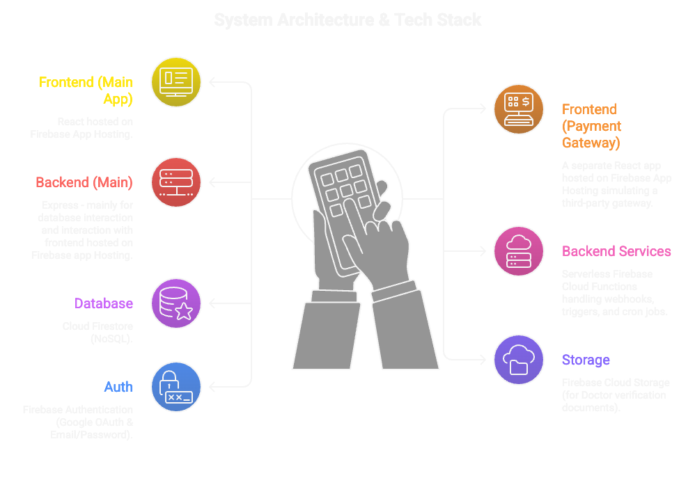
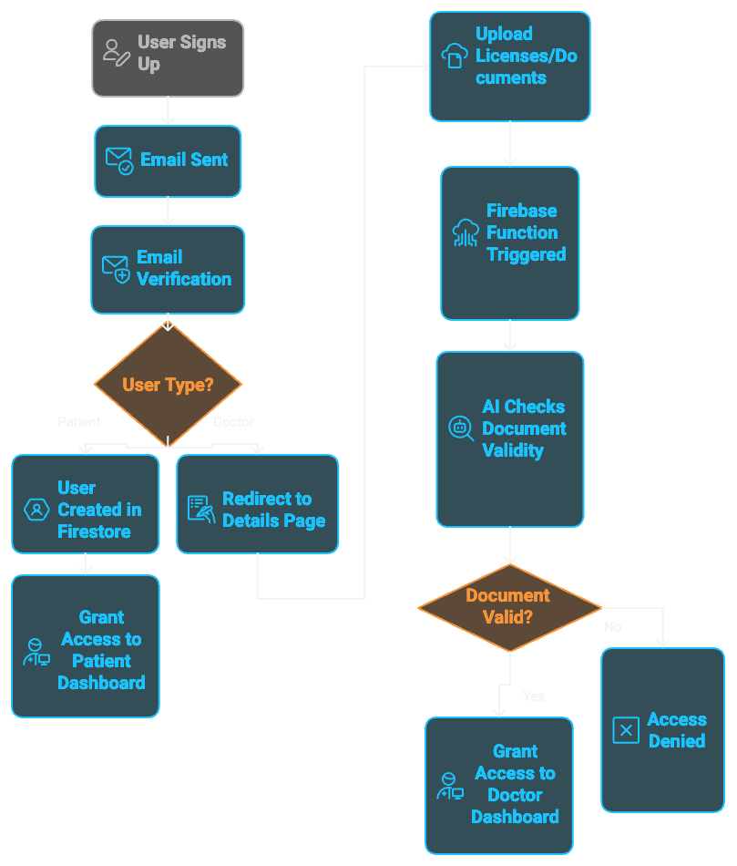
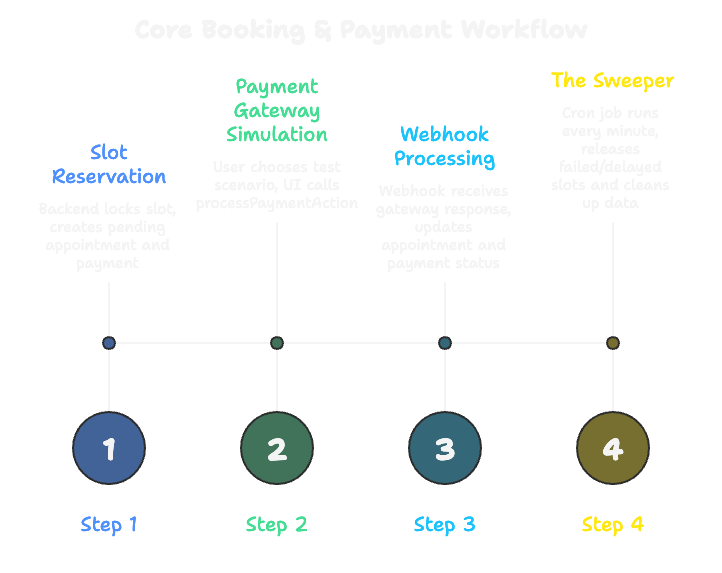

# 🏥 Medibook - End-to-End Appointment and Serverless Payment Architecture


Medibook is a robust, highly decoupled doctor appointment system. It features strict Role-Based Access Control (RBAC), automated AI-driven doctor verification, transactional slot booking to prevent concurrency issues, and a fully custom simulated Payment Gateway communicating via Webhooks and Cron Jobs.

---

## 🏗 System Architecture & Tech Stack

The architecture is split into micro-frontends and microservices to ensure scalability and separation of concerns. 




*   **Frontend (Main App):** React hosted on Firebase App Hosting.
*   **Frontend (Payment Gateway):** A completely isolated React app simulating a third-party gateway, hosted on Firebase App Hosting.
*   **Backend (Main):** Node.js/Express server used primarily for structured database interactions App Hosting.
*   **Backend Services:** Firebase Cloud Functions for serverless event-driven logic (Webhooks, Triggers, Cron Jobs).
*   **Database & Storage:** Cloud Firestore (NoSQL) for fast querying and Firebase Storage for secure document uploads.

---

## 🔐 Authentication & Verification Flow

We utilize a strict verification pipeline to ensure only authentic doctors can post slots on the platform.




1.  **User Signup:** Users register via Google OAuth or Email/Password. Email verification is enforced.
2.  **Role Routing:** Based on their selected role, Patients go straight to the dashboard, while Doctors are redirected to a detail collection page.
3.  **Document Upload:** Doctors upload licenses to **Firebase Cloud Storage**.
4.  **AI Verification (Trigger):** A Firebase Storage trigger fires automatically, passing the document to an AI for validation.
5.  **Access Granted:** If valid, the system updates the database, setting Custom Claims (`role: doctor`), granting full access to the Doctor Dashboard.

---

## 💳 Core Booking & Payment Workflow

To ensure no two patients can double-book a doctor's slot simultaneously, the system uses strict **Firestore Transactions**, a custom Payment Gateway, Webhooks, and automated Cron Jobs.




### Step 1: Slot Reservation (Main Backend)
When a patient clicks "Book Slot", they are redirected to our Payment Gateway Frontend. Behind the scenes:
*   The backend runs an `await db.runTransaction()`.
*   It checks if `bookedCount < Capacity`. If valid, it locks the slot by incrementing `bookedCount` by `1`.
*   It creates an **Appointment** (`status: 'pending_payment'`) and a **Payment** (`status: 'pending'`).

### Step 2: Payment Gateway Simulation
On the external Payment Gateway UI, the user is presented with three test scenarios. After a few seconds, the UI calls our `processPaymentAction` Cloud Function:
*   🟢 **Success:** Triggers the webhook instantly with a `success` payload.
*   🔴 **Failed:** Triggers the webhook instantly with a `fail` payload.
*   🟡 **Delayed:** Simulates a network drop. Updates Payment to `delayed` but **does not** trigger the webhook.

### Step 3: Webhook Processing
Our secure Webhook function (`processPaymentWebhook`) catches the Gateway's response and runs a transaction to safely update records:
*   **On Success:** Updates Payment to `success` and Appointment to `confirmed`. The frontend instantly reflects the confirmed booking.
*   **On Failed:** Updates Payment and Appointment statuses to `failed`.

### Step 4: The Sweeper (Cron Job)
To prevent abandoned or "delayed" bookings from locking up a doctor's schedule permanently, a Firebase Scheduled Function runs **every minute**.
*   It queries for payments stuck in `failed` or `delayed` states.
*   **Releases the Slot:** It safely decrements the `bookedCount` on the Slot document, making it public again.
*   **Data Cleanup:** It deletes the dead Appointment and Payment documents to maintain a clean database.

---

## 🚀 Local Setup & Installation
This guide is only for running the project on your local machine.

## 1) Project Parts

This repository has 4 runnable parts:

- `backend` - main Node.js API (set local `http://localhost:4001` to avoid conflict)
- `frontend` - main React app (Vite)
- `payment-system-frontend` - payment React app (Vite)
- `firebase-functions/doctor-approval/functions` - Firebase Functions for doctor approval + payment actions

## 2) Prerequisites

Install these first:

- Node.js `24.x` (Firebase Functions in this repo uses Node 24)
- npm (comes with Node)
- Firebase CLI

Install Firebase CLI globally (if not installed):

```bash
npm install -g firebase-tools
```

Login to Firebase once:

```bash
firebase login
```

## 3) Install Dependencies

From the repository root, run:

```bash
cd backend && npm install
cd ../frontend && npm install
cd ../payment-system-frontend && npm install
cd ../firebase-functions/doctor-approval/functions && npm install
```

## 4) Environment Setup

### 4.1 Backend env

Create `backend/.env` from `backend/.env.example`:

```env
PORT=4001
ADMIN_SECRET=change-this-secret
FIREBASE_STORAGE_BUCKET=your-project-id.firebasestorage.app
```

Notes:

- `PORT=4001` avoids conflict with Firebase Functions emulator (`4000`).
- `FIREBASE_STORAGE_BUCKET` is required by `backend/src/config/firebase.js`.

### 4.2 Frontend env

Create `frontend/.env` from `frontend/.env.example` and add the payment URL key used by the app:

```env
VITE_FIREBASE_API_KEY=your_firebase_api_key
VITE_FIREBASE_AUTH_DOMAIN=your-project-id.firebaseapp.com
VITE_FIREBASE_PROJECT_ID=your-project-id
VITE_FIREBASE_STORAGE_BUCKET=your-project-id.firebasestorage.app
VITE_FIREBASE_MESSAGING_SENDER_ID=your_sender_id
VITE_FIREBASE_APP_ID=your_app_id
VITE_API_BASE_URL=http://localhost:4001
VITE_PAYMENT_GATWAY_URL=http://localhost:5174
```

Important:

- Keep the key name exactly as `VITE_PAYMENT_GATWAY_URL` (same spelling as code).

### 4.3 Payment frontend env

Create `payment-system-frontend/.env`:

```env
VITE_API_BASE_URL=http://localhost:4001
VITE_PAYMENT_FUNCTION_URL=http://127.0.0.1:4000/medibook-3624a/us-central1/logPaymentAction
```

If your backend/payment API is on another port, update `VITE_API_BASE_URL` accordingly.

### 4.4 Firebase Functions secrets (local)

These functions read secrets:

- `OPENAI_API_KEY`
- `PAYMENT_WEBHOOK_SECRET`

Before starting Firebase emulators, set them in the same terminal session:

```bash
export OPENAI_API_KEY=your_openai_key
export PAYMENT_WEBHOOK_SECRET=your_webhook_secret
```

### 4.5 Firebase Functions secrets (Firebase Secret Manager - recommended)

For deployed Firebase Functions, store sensitive values in Secret Manager (not in `.env`).

Set secrets:

```bash
cd firebase-functions/doctor-approval/functions
firebase functions:secrets:set OPENAI_API_KEY
firebase functions:secrets:set PAYMENT_WEBHOOK_SECRET
```

Then deploy functions so new secret versions are attached:

```bash
firebase deploy --only functions
```

Useful secret commands:

```bash
firebase functions:secrets:access OPENAI_API_KEY
firebase functions:secrets:access PAYMENT_WEBHOOK_SECRET
firebase functions:secrets:destroy OPENAI_API_KEY
```

How it connects to code:

- In `functions/index.js`, secret names are declared in each function options (for example `secrets: ["OPENAI_API_KEY"]`).
- In code, read them normally with `process.env.OPENAI_API_KEY`.

### 4.6 Firebase Functions non-secret env vars

Use non-secret env vars for normal config (feature flags, non-sensitive URLs, etc.).

Create a `.env` inside `firebase-functions/doctor-approval/functions` for local/emulator use:

```env
SOME_PUBLIC_CONFIG=value
ANOTHER_NON_SECRET=value
```

Then read in code with:

```js
process.env.SOME_PUBLIC_CONFIG
```

For production:

- Keep secrets in Secret Manager (`firebase functions:secrets:set ...`).
- Keep only non-sensitive values in `.env`-style config for Functions.
- Never put keys like `OPENAI_API_KEY`, webhook secrets, private tokens, or passwords in `.env` committed to git.

### 4.7 Frontend production config with `apphosting.yaml`

For production hosting (Firebase App Hosting), this project uses:

- `frontend/apphosting.yaml`

This file defines:

- build/start commands
- production environment variables
- where each variable is available (`BUILD`, `RUNTIME`)

Current frontend production variables in `frontend/apphosting.yaml`:

- `VITE_API_BASE_URL`
- `VITE_PAYMENT_GATWAY_URL`
- `VITE_FIREBASE_API_KEY`
- `VITE_FIREBASE_AUTH_DOMAIN`
- `VITE_FIREBASE_PROJECT_ID`
- `VITE_FIREBASE_STORAGE_BUCKET`
- `VITE_FIREBASE_MESSAGING_SENDER_ID`
- `VITE_FIREBASE_APP_ID`

Important rules:

- `VITE_*` values are browser-visible in frontend builds, so use them only for public client config.
- Do not store private secrets in `VITE_*` variables.
- If App Hosting runtime needs a true secret, use `secret:` in `apphosting.yaml` with a non-`VITE_` variable name.

Minimal secret pattern in `apphosting.yaml` (runtime-only):

```yaml
env:
  - variable: SERVER_API_KEY
    secret: medibook_server_api_key
    availability:
      - RUNTIME
```

### 4.8 Payment frontend production config with `apphosting.yaml`

For the payment frontend production hosting, this project uses:

- `payment-system-frontend/apphosting.yaml`

This file defines:

- build/start commands for payment frontend
- production env vars for payment flow
- availability of vars at `BUILD` and `RUNTIME`

Current payment frontend production variables:

- `VITE_API_BASE_URL`
- `VITE_PAYMENT_FUNCTION_URL`

Important rules (same as main frontend):

- `VITE_*` values are public in browser builds.
- Never place private secrets in `VITE_*` variables.
- Use Secret Manager (`secret:`) with non-`VITE_` names for true secrets needed only at runtime.

## 5) Run Locally (4 terminals)

Open 4 terminals from the repository root and run:

### Terminal 1 - Firebase Functions + Firestore emulator

```bash
cd firebase-functions/doctor-approval/functions
npm run serve
```

Expected local ports from `firebase.json`:

- Functions: `4000`
- Firestore emulator: `8080`
- Emulator UI: `2000`

### Terminal 2 - Backend API

```bash
cd backend
npm run dev
```

Backend runs at:

- `http://localhost:4001`

### Terminal 3 - Main frontend

```bash
cd frontend
npm run dev
```

Vite usually starts at:

- `http://localhost:5173`

### Terminal 4 - Payment frontend

```bash
cd payment-system-frontend
npm run dev
```

Vite usually starts at:

- `http://localhost:5174` (or next available port)

## 6) Quick Verification Checklist

After all services are running:

- Open `http://localhost:5173` (main app loads)
- Open `http://localhost:5174` (payment app loads)
- Visit `http://localhost:4001/` (should return `Root is working`)
- Open emulator UI at `http://localhost:2000`

## 7) Common Issues

### Port already in use

- Stop the process using that port, or change the port in env/config and matching frontend URLs.

### Firebase permission/credential errors in backend

- Ensure your Firebase project settings are correct.
- If needed, configure Google Application Default Credentials for local machine:
  - set `GOOGLE_APPLICATION_CREDENTIALS` to your service account JSON path.

### App cannot call payment function

- Ensure Firebase emulator is running.
- Ensure `VITE_PAYMENT_FUNCTION_URL` points to your local callable URL.

